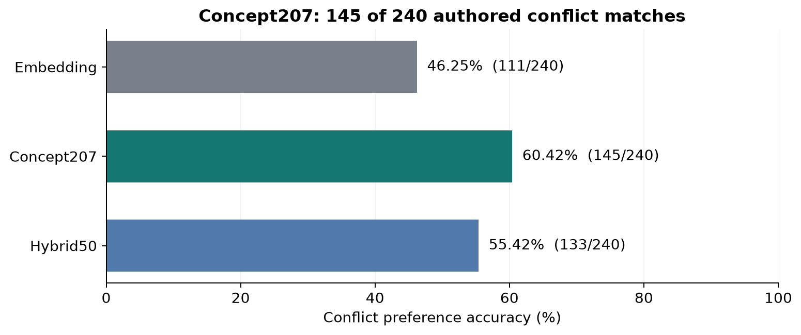

# Attribute Projections for Conflict Similarity in Text Embeddings

[](https://colab.research.google.com/github/sarrumkin/concept-projection-dilemmas/blob/main/notebooks/research.ipynb)

A reproducible experiment on conceptual representations of text embeddings. The study tests whether **Concept207**, a fixed projection onto decision attributes, helps identify a shared conflict in dilemmas with different subject matters. On 240 English triplets, Concept207 matches the authored conflict relation in **145 cases (60.42%)**, compared with **111 (46.25%)** for the original embedding.

In an additional corpus-retrieval evaluation, **Hybrid50 outperforms both the original embedding and Concept207 used separately**: nDCG@10 is **0.6099**, versus 0.5576 and 0.5458, respectively. The same ordering holds at nDCG@5. These findings distinguish the best representation for the authored two-candidate comparison (Concept207) from the best for retrieval over this corpus (Hybrid50).

The attribute system originates from [Bhatia et al. (PNAS, 2025)](https://doi.org/10.1073/pnas.2406489122), who analysed more than 100,000 dilemmas from Reddit and a US survey. Their pipeline extracted benefits and costs with GPT and mapped them onto 207 attributes using SBERT. In Study 4a, fitted individual attribute models achieved a mean R² of 0.24, versus 0.14 for text and random-attribute models. Those fits used eight dilemmas per participant; they did not measure dilemma retrieval. The present study borrows the attributes and compares whole texts.

## Objective and hypotheses

Each triplet contains an anchor **A**, a candidate **B** with the same authored conflict class in another topic, and a candidate **C** with another conflict in the same assigned topic. The target preference is `d(A, B) < d(A, C)`.

- **Primary H1:** Concept207 increases the proportion of target preferences relative to the original embedding.
- **Secondary H2:** Hybrid50, a fixed 50/50 mixture of embedding and Concept207 distances, also improves this proportion relative to the embedding.

The central question concerns the geometry induced by Concept207. The projection is deterministic and adds no information to its input.

## Two verified illustrations

The following summaries illustrate observed changes from C to B. Both final AI audits prefer B. These examples were selected **after scoring**; they do not replace the evaluation on all 240 triplets. Complete, unchanged paragraphs appear in the [notebook](notebooks/research.ipynb) and [corpus](study/original/data/triplets.json).

**e266383 — health versus duty.** A musician considers performing with an injured wrist; a snowplow driver considers working while dizzy to keep an ambulance route clear. Both weigh health against an obligation. The alternative concerns traditional theatre scenery versus digital projections.

**e365088 — ambition versus belonging.** A vineyard owner and a ceramics maker consider expansion that would separate them from their communities. The alternative concerns an experimental crop versus a predictable harvest.

| Example | Representation | d(A, B) | d(A, C) | Preferred |
|---|---|---:|---:|:---:|
| e266383 | Embedding | 0.87150 | 0.65960 | C |
| e266383 | **Concept207** | **0.61701** | **1.01890** | **B** |
| e266383 | Hybrid50 | 0.74425 | 0.83925 | B |
| e365088 | Embedding | 0.57383 | 0.43634 | C |
| e365088 | **Concept207** | **0.48518** | **0.64617** | **B** |
| e365088 | Hybrid50 | 0.52950 | 0.54125 | B |

Cosine distance is `1 − cosine`, with range **[0, 2]**. Values above 1 are valid; smaller distances determine the preference.

## Design and representations

The fixed corpus contains **720 unique English paragraphs**: 12 conflict classes × 10 assigned topics × 2 variants. Four AI authoring branches produced the texts. The encoder is [multilingual MiniLM-L12-v2](https://huggingface.co/sentence-transformers/paraphrase-multilingual-MiniLM-L12-v2), with 384 dimensions, pinned to revision `e8f8c211226b894fcb81acc59f3b34ba3efd5f42`. Labels, metadata and audit explanations are excluded from encoder input.

For unit embedding `z` and fixed prototype matrix `P`:

```text
Concept207: c = normalize(z @ (P − mean_rows(P)).T)    # 207 dimensions
Hybrid50:   h = concatenate(z / √2, c / √2)           # 591 dimensions
```

No parameters are fitted to the corpus labels. Reasons are not extracted from individual dilemmas. Accuracy assigns 1 to the target preference, 0 to its reverse and 0.5 to an exact tie. [Full methods and protocol history](docs/methods.md).

## Results on all 240 triplets

| Representation | Correct / 240 | Accuracy | Difference vs embedding | 95% descriptive interval |
|---|---:|---:|---:|---:|
| Embedding | 111 | 46.25% | — | — |
| **Concept207** | **145** | **60.42%** | **+14.17 pp** | **[+2.50, +27.08] pp** |
| Hybrid50 | 133 | 55.42% | +9.17 pp | [+0.42, +19.58] pp |



Concept207 corrects **55** baseline errors and introduces **21** new errors. Hybrid50 corrects 36 and introduces 14.

The [additional results](docs/additional_results.md) present the bootstrap intervals and random-projection controls, with figures and methodological notes. Both analyses are also included in the [notebook](notebooks/research.ipynb).

## Exploratory corpus retrieval: nDCG

As an additional analysis, each of the 240 A texts queries the other 719 corpus texts, ranked by cosine similarity. A candidate is relevant when its authored conflict class matches the query's class; each query has 59 relevant candidates. The query itself is excluded, and topics do not filter candidates. nDCG measures how early relevant texts appear, normalized by the ideal ranking at the same cutoff. Scores below are means over all queries; higher is better.

| Representation | nDCG@5 | nDCG@10 |
|---|---:|---:|
| Embedding | 0.6168 | 0.5576 |
| Concept207 | 0.5995 | 0.5458 |
| **Hybrid50** | **0.6725** | **0.6099** |

**For this corpus-retrieval task, the hybrid works better than either method used separately.** At nDCG@10, Hybrid50 gains **+0.0523 over Embedding** and **+0.0641 over Concept207**; it also leads at nDCG@5. Concept207's triplet accuracy advantage does not extend to the retrieval ranking.

This analysis was added after the original experiment; it uses authored class labels without corpus-wide human relevance judgments. It does not replace the primary triplet comparison. [Retrieval protocol and tie handling](docs/methods.md#exploratory-retrieval-ndcg), [interpretation of the different rankings](docs/additional_results.md#corpus-retrieval-and-the-hybrid-advantage).

## Interpretation and limitations

The results support two task-specific conclusions: **Concept207 performs best on the authored B-versus-C comparison; Hybrid50 performs best on corpus retrieval at both nDCG cutoffs.** A correct B-versus-C preference can occur far below the first ten retrieval positions. The hybrid's advantage is consistent with the two representations providing complementary similarity signals, although this experiment does not establish the causal mechanism.

These results do not establish a universal projection or hybrid advantage or general retrieval performance. The texts and labels are AI-generated, assigned thematic roles require validation, and there are no independent human judgments. Bootstrap intervals for the original triplet analysis describe sensitivity within this design, not population uncertainty.

Both final AI audits agree with the authored choice on 225 triplets. Joint agreement was initially 140; candidate-letter/explanation alignment corrections increased it to 225. All 240 triplets remain in the primary evaluation. [Data and audit history](docs/data.md), [research branch reports](docs/research_branches.md).

## Reproduce the experiment

**Python 3.12; CPU.** Clone and install the lightweight dependencies:

```bash
git clone https://github.com/sarrumkin/concept-projection-dilemmas.git
cd concept-projection-dilemmas
python3.12 -m venv .venv
source .venv/bin/activate
python -m pip install -r requirements.txt
python reproduce.py --mode cached --output artifacts/cached
```

Cached mode recomputes all 720 primary and 28,800 control comparisons, the bootstrap intervals, and exploratory nDCG from supplied embeddings. It writes per-query retrieval scores to `retrieval_per_query.csv` and method means to `retrieval_summary.csv` alongside the original result tables. It requires no model download or API key after dependencies are installed.

For a full run, including fresh embeddings of the texts **and attribute descriptions**:

```bash
python -m pip install -r requirements-full.txt
python reproduce.py --mode full --output artifacts/full
```

The first full run downloads the pinned model from Hugging Face. Outputs go to separate directories; reference data are preserved. The [notebook](notebooks/research.ipynb) supports both modes and includes saved tables and figures. The Colab badge opens the same notebook. See [reproduction checks](docs/reproduction.md) for the tested environment and numerical agreement.

## Materials and citation

The repository contains the corpus, attribute descriptions, fixed prototypes, reference vectors, all scores, control seeds, historical protocol and [reports](study/original/reports/INDEX.md). Archival Russian documents retain their original language; the public README, methods and main notebook are in English. Path-only output redactions are documented in the [provenance record](docs/source_transformations.json).

Maintained by **sarrumkin**. Original project materials are MIT-licensed; third-party notices are preserved in [NOTICE](NOTICE). Model weights and the article PDF are not distributed. Use [CITATION.cff](CITATION.cff) to cite this version. Reproducibility questions can be submitted through this repository's issues.
