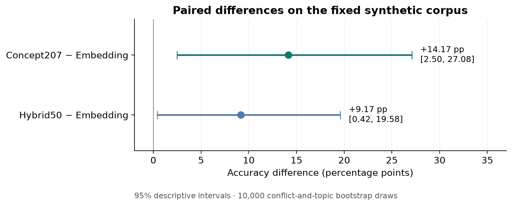
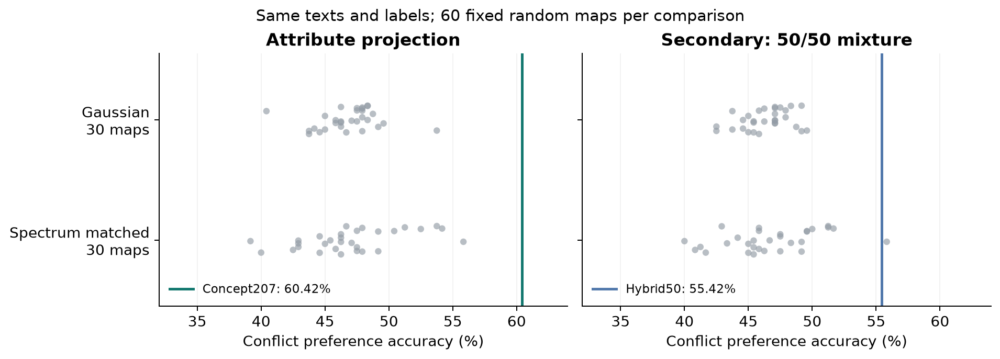

# Additional results

These analyses supplement the triplet accuracy and corpus-retrieval comparisons in the [README](../README.md). The [notebook](../notebooks/research.ipynb) reproduces the figures and nDCG table from the experiment outputs.

## Corpus retrieval and the hybrid advantage

**On this fixed corpus, Hybrid50 outperforms the original embedding and Concept207 used separately at both nDCG@5 and nDCG@10.** Each of the 240 A queries ranks 719 other texts; binary relevance means sharing its authored conflict class.

| Representation | nDCG@5 | nDCG@10 |
|---|---:|---:|
| Embedding | 0.6168 | 0.5576 |
| Concept207 | 0.5995 | 0.5458 |
| **Hybrid50** | **0.6725** | **0.6099** |

Hybrid50's absolute gains over Embedding are +0.0557 at nDCG@5 and +0.0523 at nDCG@10. Its gains over Concept207 are +0.0729 and +0.0641, respectively. These values come from `retrieval_summary.csv`; `retrieval_per_query.csv` retains all 720 method/query scores.

### Why the ranking differs from triplet accuracy

The two evaluations ask different questions. Triplet accuracy checks whether a chosen B is closer to A than a chosen C. Ranking B ahead of C is sufficient even if both are far down the corpus ranking. nDCG@5 and nDCG@10 instead reward placing any of the query's 59 relevant texts near the top of the 719-candidate pool. Better ordering of the chosen pair therefore need not produce better top-k retrieval.

Hybrid50 averages the embedding and Concept207 cosine distances. Its retrieval advantage is consistent with complementary similarity signals: the original geometry can retain distinctions that the attribute projection weakens, while the projection can emphasize decision attributes that the original geometry underweights. This is a possible explanation of the observed result, not an established causal mechanism.

The supported conclusion is specific to this experiment: Concept207 has the highest authored triplet accuracy, while the hybrid has the highest mean corpus-retrieval nDCG at both tested cutoffs. The retrieval analysis was added after the frozen experiment and uses authored class labels rather than independent human relevance judgments. The table reports observed means; the bootstrap intervals and random controls below concern the original triplet metrics, not nDCG. No universal superiority or inferential significance is claimed from these retrieval means alone.

## Paired accuracy differences

Concept207 corrects **55** baseline errors and introduces **21** new errors, a net gain of 34 correct preferences out of 240 (+14.17 percentage points). Hybrid50 corrects 36 and introduces 14, a net gain of 22 (+9.17 points).

The points show accuracy differences relative to the embedding baseline; the horizontal segments show 95% descriptive bootstrap intervals. The intervals use 10,000 paired draws over conflicts and topics, retaining both variants in each sampled cell. The Concept207 interval is [+2.50, +27.08] percentage points; the Hybrid50 interval is [+0.42, +19.58]. These intervals describe sensitivity within the fixed synthetic design, not population uncertainty for naturally occurring dilemmas.

## Random-projection controls

Thirty Gaussian maps and thirty random orientations with the attribute map's singular spectrum are evaluated separately and in 50/50 mixtures. Each grey point represents one random map's accuracy on the same 240 triplets; each coloured line marks the corresponding attribute-based representation.

**Concept207 exceeds all 60 standalone controls**: its accuracy is 60.42%, while the best control reaches 55.83%. One of the 60 random mixtures exceeds Hybrid50. Thus, the selected attribute projection outperforms all tested standalone random alternatives on this corpus, while the hybrid does not outperform every control mixture.

The map comparisons are descriptive. The maps share the same texts and labels and do not constitute additional independent datasets or establish a universal advantage over random projections.

See the [methods](methods.md) for the representation definitions and [reproduction checks](reproduction.md) for numerical verification.
